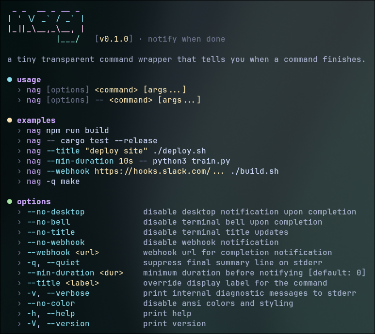

<div align="center">

<br>

## nag



**a tiny transparent command wrapper that tells you when a command finishes.**

[](https://crates.io/crates/nag-cli)
[](https://aur.archlinux.org/packages/nag-bin)
[](https://github.com/programmersd21/nag/actions)
[](LICENSE)

<br>

</div>

prefix any command with `nag` and get notified the moment it finishes — desktop notification, terminal bell, title update, or webhook. zero stdout interference, full exit code fidelity, unix signal forwarding.

## install

**cargo**

```
cargo install nag-cli
```

**arch linux (aur)**

```
yay -S nag-bin
```

**prebuilt binaries** — [github releases](https://github.com/programmersd21/nag/releases)

## usage

```
nag <command> [args...]
nag [options] -- <command> [args...]
```

| example | description |
| :--- | :--- |
| `nag cargo test` | run and notify on finish |
| `nag -- cargo test --release` | pass flags with `--` |
| `nag --title "deploy" ./deploy.sh` | override display label |
| `nag --min-duration 10s -- cargo build` | suppress alerts for fast runs |
| `nag --webhook https://hooks.slack.com/... ./build.sh` | send webhook on finish |
| `nag -q make` | quiet mode — no summary line |

## options

| flag | default | description |
| :--- | :---: | :--- |
| `--no-desktop` | — | disable desktop notification |
| `--no-bell` | — | disable terminal bell |
| `--no-title` | — | disable terminal title updates |
| `--no-webhook` | — | disable webhook |
| `--webhook <url>` | — | webhook url |
| `-q, --quiet` | — | suppress summary line |
| `--min-duration <dur>` | `0` | suppress notifications under this duration (e.g. `10s`, `1m`) |
| `--title <label>` | — | override command display label |
| `-v, --verbose` | — | print diagnostic messages |
| `--no-color` | — | disable color output |

## config

optional at `~/.config/nag/config.toml` — all fields optional, cli flags take precedence.

```toml
[notify]
desktop = true
bell = true
title = true
webhook_url = ""
min_duration_secs = 0

[display]
live_timer = true
spinner_style = "dots"  # "dots" | "line" | "none"
show_exit_code_on_success = false
```

environment variable `NAG_WEBHOOK_URL` is also supported.

## contributing

see [CONTRIBUTING.md](CONTRIBUTING.md).

## security

see [SECURITY.md](SECURITY.md).

## license

[mit](LICENSE)
